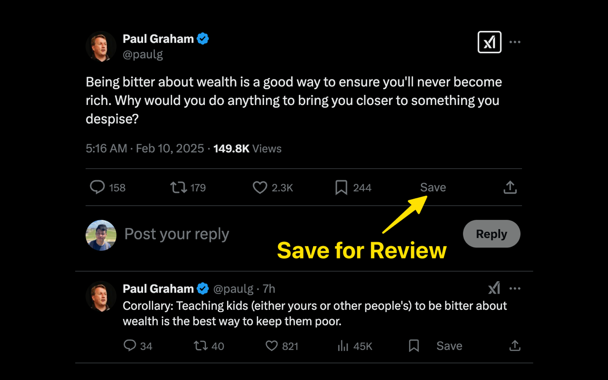
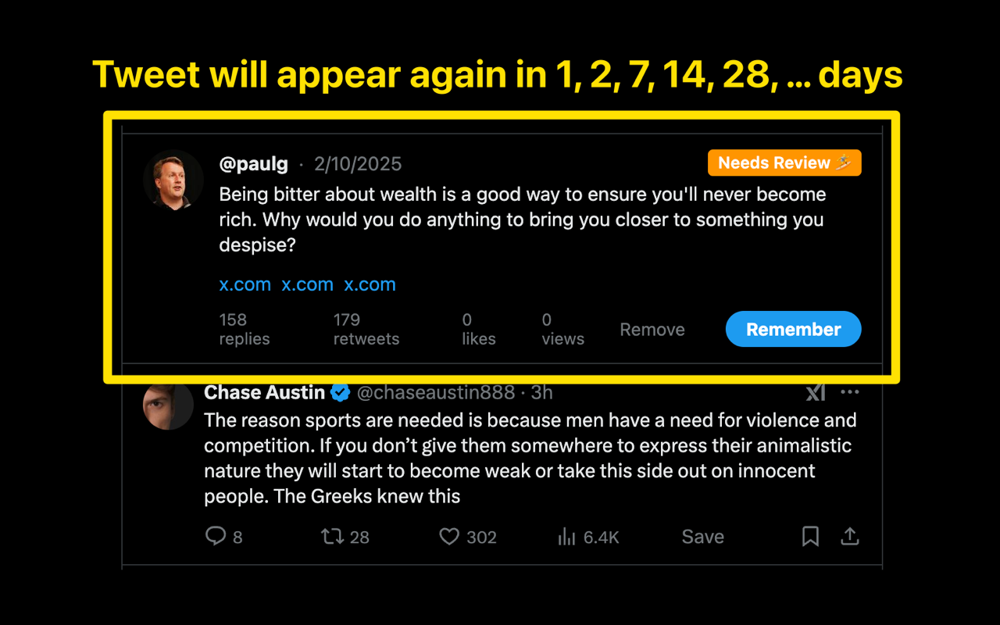

# Tweet Resurfacer

A Chrome extension that saves your best tweets and resurfaces them seamlessly and directly on your timeline. It's most helpful when you actually want to remember things instead of just keep scrolling and forgetting them the next day.

---

## Features

- Save tweets with one click.

- Saved tweets blend right into your Twitter feed. They act like any other tweet—click to open the thread.

- **Spaced Repetition:** tweets reappear at doubling intervals (capped at 1 year) to keep your mind sharp.

## Screenshots

  
*Save a tweet with one click.*

  
*Review saved tweets in your timeline.*

## Setup Guide

1. **Clone or Download the Repo:**

   ```bash
   git clone https://github.com/sangddn/tweet-resurfacer.git
   ```

2. **Load the Extension:**

   - Open Chrome and navigate to `chrome://extensions`.
   - Enable **Developer mode** (toggle in the top-right corner).
   - Click **Load unpacked** and select the `tweet-resurfacer` subfolder.

3. **How to Use:**

   - Go to [Twitter/X](https://twitter.com).
   - Look for the **"Save"** button on tweets in your timeline.
   - Click to save tweets. When a tweet’s review time comes, it will appear in your timeline as a native tweet with **"Remember"**.
   - Click "Remember" to schedule the tweet for the next review. If you don't do anything, the tweet will remain in the "Needs Review" state.
